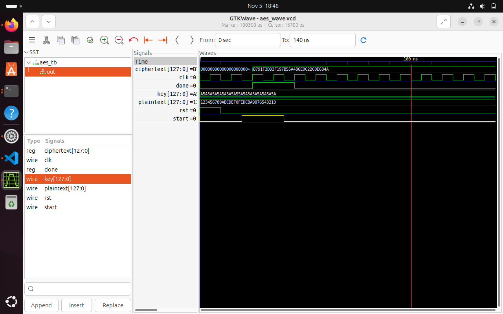

### 🧪 Simulation Result — AES Encryption

The following waveform shows the encryption process.  
`plaintext` is XORed with `key` in this simulation stub to produce `ciphertext`.  
When the operation completes, the signal `done` goes high.

