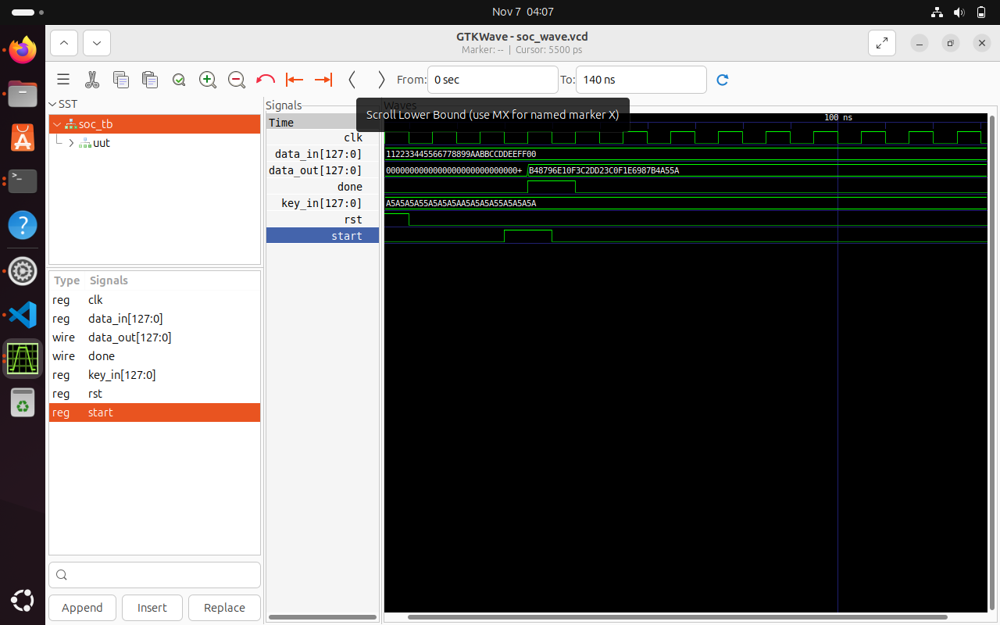

###  Simulation Result — AES Encryption

The following waveform shows the encryption process.  
`plaintext` is XORed with `key` in this simulation stub to produce `ciphertext`.  
When the operation completes, the signal `done` goes high.

---

### 🧪 Simulation Result — Top-Level SoC Integration

This waveform shows the complete SoC behavior with AES integrated.  
When `start` is asserted, encryption begins, and the `done` signal goes high when the ciphertext is ready.

---
